## 数据仓库与数据挖掘大作业报告——PageRank算法实现

##### 摘要：

###### 本文首先介绍了PageRank算法，包括其思想，算法流程和具体实现方法，并对其进行了空间和时间复杂度上的分析和改进，然后在两个数据集上使用python，分别采用不同的实现和优化方法并进行比较，得出了相应结论。

### 1. PageRank算法：

####1.1 背景及原理：

​	随着互联网的普及与发展，其所产生的信息量越来越大，如何从如此繁多庞杂的数据中提取出有效的信息一直是数据挖掘的重要课题。一种有效的解决方案是网络搜索引擎，通过关键字筛选来获得有效且重要的信息。PageRank是Google公司创办人Larry Page受到学术论文引用启发，提出来的对网页相关性和重要程度排名的一个算法。

​	PageRank算法核心思想是：对于一个网页$A$，它的重要程度$PR(A)$取决于其他网页对其的评价，而不是其自身所含有的信息。其将万维网抽象成一张有向图$G$，每个节点表示一个网页，有向边$p_i\rightarrow p_j$代表网页$p_i$包含指向$p_j$的超链接。

​	为了求解网页的PR值，他们模拟了一个虚拟的互联网用户在网上浏览网页的过程。假定用户访问了网页时，下一步会以相同的概率访问这个网页链接的任意网页。这个过程是一个收敛的$Markov$过程，可以进行迭代求解。

#### 1.2 算法描述：

​	1). 初始化：构建有向图$G$，每个页面设置相同的PageRank值$\frac{1}N$，这里$N$是所有网页数。

​	2). 迭代更新：每个页面$A$将其当前的PageRank值平均分配到其所包含的出边节点上，则每个页面都获得了相应权值。然后每个页面$A$将所有指向本页面的的入边权值求和，得到新的PageRank值。计算所有页面上一轮与本轮PageRank值之差的绝对值之和，若其小于给定精度则认为以达到收敛，迭代结束。

#### 1.3 改进：

​	由于存在一些网页，其出边为0，对于这样的网页，采用原始的PageRank思想对它计算会使得它的PR值接近1，但这显然是不合理的，而对于只有出边的点，则其PR值一定为0。所以增加一项阻尼系数 $\alpha$(damping factor) ，其含义是用户在到达某网页后，以$\alpha$的概率继续点击其内含的链接浏览，以$1-\alpha$的概率打开新的网页进行浏览，使得其他节点能获得一定的得分。从而计算一个页面A的PR值的公式为：

$ PR(A) =\frac{1-\alpha}{N} + \alpha\Sigma_{v∈B_A}{\frac{PR(v)}{L(v)}} \tag{1}$

其中$B_A$表示链接到A网页的所有网页集合，$L(v)$表示顶点$v$的出度。

写成矩阵形式即：

$ R=\alpha M R +  \frac{( 1-\alpha)}{N}I \tag{2}$

这里$R$即PR值矩阵，$$M_{ij}=\begin{cases}  \frac{1}{L(p_j)}, & if \ j\ links\ to\ i\\  0, & otherwise  \end{cases}$$ 

#### 1.4 幂法实现：

实际上，对于$(2)$式，可以将其改写为：

$R= \hat {M} R  \tag{3}$

其中

$\hat{M} =\alpha R +\frac {1-\alpha}{N}M^{-1} \tag{4}$

因此可将$R$视为$\hat{M}$的主特征向量，从而可以用幂法迭代计算，伪代码如下：

$\vec{x}\leftarrow\frac{1}{\vec{n}}$

$flag\leftarrow True$

$while\ flag:$

$\ \ \ \ \ \ \ \ \ \ \ \  \vec{x}_{t+1}\leftarrow G·\frac{\vec{x}_t·\beta}{l_{out}}$

$\ \ \ \ \ \ \ \ \ \ \ \ \vec{x}_{t+1}\leftarrow\vec{x}_{t+1}+\frac{1-\vec{x}_{t+1}}{n}$

$\ \ \ \ \ \ \ \ \ \ \ \ flag\leftarrow||\vec{x}_{t+1}-\vec{x}_t||_1<\epsilon$

$\ \ \ \ \ \ \ \ \ \ \ \ \vec{x}_{t}\leftarrow\vec{x}_{t+1}$

这里$G$为图的邻接矩阵，$l_{out}$为节点的出边值。

### 2. 算法实现及优化：

我选择采用Python实现。参考1的原理，我实现了4个不同的PageRank，前两个主要作为baseline方便对比：

​	1) 使用Networkx库中的有向图DiGraph存储图，使用更新公式$(1)$迭代更新的NaivePageRank.py.

​	2) 使用Networkx库自带的pagerank、pagerank_numpy、pagerank_scipy和google_matrix四个函数处理的PageRankWithNX.py.

​	3) 使用字典存储图和上述更新公式$(1)$迭代更新的PageRankFast.py。

​	4) 使用scipy稀疏矩阵存储图，numpy进行矩阵计算，使用幂法迭代更新的PageRankAdvanced.py。

#### 2.1 数据集来源

数据集我选用了一大一小两个。大数据集来自http://socialcomputing.asu.edu/datasets/Twitter，具体规模如下：

其中边数应为$85331845$而非他所说的$85331846$...这是一个坑。

小数据集来自SNAP-Stanford，http://snap.stanford.edu/data/web-Stanford.html，含有$281903$个顶点和$2312497$条边：

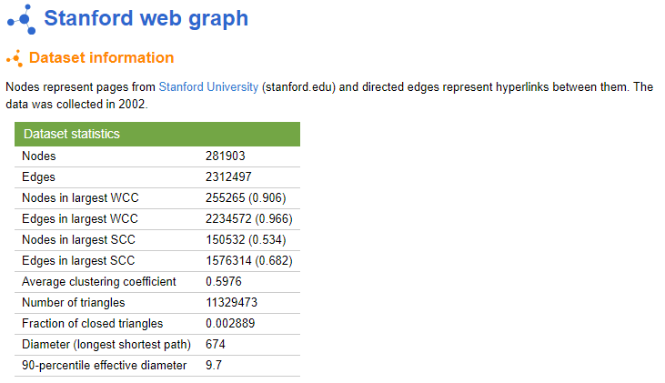

####2.2 实现细节与优化

​	空间复杂度：最开始时，我只实现了算法 1) 和 3)，没有使用矩阵进行存储和运算，而是利用Python的字典存储有向图，因为使用矩阵存储的空间复杂度是$O(V^2)$的，用邻接表进行存储空间复杂度为$O(V+E)$。对于网页的情况，$G$通常是一个稀疏矩阵，边数远远不及$V^2$的量级，并且Python的字典查找效率是$O(1)$的，比起list的查找高效许多。后来发现scipy库有稀疏矩阵的实现，于是试着使用稀疏矩阵存储，scipy的稀疏矩阵有许多格式，这里我选用$CSR $($Compressed\ Sparse\ Row\ Format$，行压缩格式)，因为其对矩阵运算支持比较多，效率更高，同时比较稳定，并且考虑到一个网页也许会被很多网页引用但不会指向太多网页，应采用行压缩而不是列压缩。其他格式比如$coo$对许多矩阵运算都不支持或者效率极低，$dok$则和字典相差无几，建立时间比较久。采用$CSR$稀疏矩阵的存储方案已经十分优化了，小数据集可以从原始$280,000^2*1(Byte)\approx70GB$的内存开销降低到$12M$左右，大数据集则可以从$11,000,000^2*1(Byte)\approx93300GB$压缩到$450M$。

​	时间复杂度：在迭代更新的过程中，我选择实现公式$(1)$中的算法，因为普通的向量和矩阵乘法复杂度是$O(n^2)$，这对于大数据集来说是不可接受的，并且对于稀疏矩阵是及其浪费的，而通过出边字典找到指向本网页的所有节点，再通过出边字典获取本网页得到的权重值，即函数updatePR中的：

$t\ \ \  +=   1.0 / len(edgeOut[  fromNode]) * v[fromNode] \tag5$

​	这样规避了矩阵乘法，时间复杂度由原先的$O(V^2)$变成了$O(E)$。

​	此外，对于稀疏矩阵，其计算复杂度只与非零元素相关，而与矩阵总大小无关，所以使用它做矩阵乘法更加快捷，并且根据原论文，迭代求解至收敛只需$50-100$轮，所以稀疏矩阵+幂法应该也是一个高效的算法。

​	最后考虑到Python语言本身的效率问题，我也使用了pypy$^{[4]}$进行编译加速作为对照。

### 3. 实验结果：

实验环境为win10系统，CPU为四核Intel i5 7500U，16G内存。

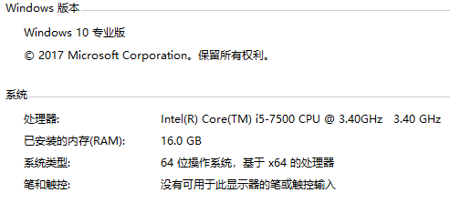

软件环境为:

​	python==3.6.3

​	numpy==1.13.3

​	scipy==1.0.0

​	networkx==2.1

​	pypy2 for windows x86

运行时参数统一设置为：阻尼系数$\alpha=0.85$，损失精度$\epsilon=1*10^{-10}$，最大迭代次数为$1000$。

对于大数据集：

​	 1) 和 2) 都会出现Memory Error，因为没有进行内存优化，无法存储下如此多的节点和边。3) 在大数据集上的运行时间为3563s，即1h左右，而 4) 在大数据集上运行时间仅为100s不到，不过当进程开得比较多的时候也会偶尔出现Memory Error（建议关闭所有应用程序之后再运行代码），可见16G内存对于如此大的数据集处理是十分吃力的，即便用上了优化的空间存储方案，主要是将数据集文件读入并转成稀疏矩阵这一步使用的临时变量占空间很大，如果可以逐步或者分段压缩的话应该就不会出现内存占用过多的问题了：

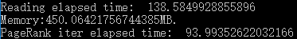

对于小数据集：

​	NaivePageRank.py仍然十分耗时，超过了300s：

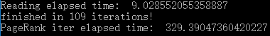

​	调用Networkx库的PageRankWithNX.py中pagerank和pagerank_scipy消耗的时间如下：

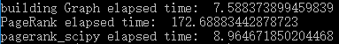

​	另外两个函数pagerank_numpy和google_matrix都会出现Memory Error，无法运行。

​	调用Networkx库的PageRankWithNX.py消耗的时间如下：

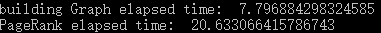

​	使用Python运行PageRankFast.py消耗时间如下：

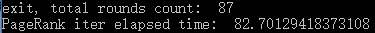

​	使用pypy运行PageRankFast.py消耗时间如下：

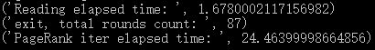

​	使用python运行PageRankAdvanced.py消耗时间如下：

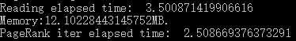

代码运行方法：4个皆可简单地使用python [filename]运行，我都设置了合理的默认参数，当然也可在命令行中声明PageRank的一些参数，PageRankWithNX.py可以额外声明-type选择算法类型：

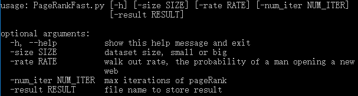

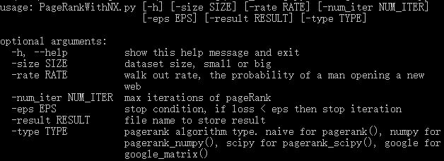

此外安装了pypy的话也可以使用pypy PageRankFast.py命令运行，运行另外的文件需要安装pypy下的numpy和scipy。

### 4.结论与改进：

​	从上述实验结果可以看出，朴素的PageRank，空间复杂度和时间复杂度都极高，无法处理大规模的数据集，Networkx库的pagerank_scipy实现比较快，但是也无法处理超大规模数据集，并且时间并不如使用numpy和稀疏矩阵优化后的PageRank。pagerank_numpy和google_matrix函数似乎也没对内存进行优化，在小数据集上都无法运行。由于图G的稀疏特性，在改进了图的存储方式后，PageRank算法可以对更大的数据集使用，使用pypy编译运行的结果基本和Networkx库实现的PageRank性能相当，并且空间复杂度更优，而使用numpy和scipy进一步优化后的算法效率则更高，相比PageRankFast.py又提升了30多倍的速度，一方面是numpy对矩阵计算的优化，另一方面是对于稀疏矩阵，幂法能更快的迭代至收敛。

​	考虑到python语言本身效率比较低，从实验结果可以看出使用pypy编译运行速度可以加快5倍左右，经过上述改进之后的算法 4) 效率已经很高了，算法 4) 我没有用pypy编译运行，因为只有pypy3 v6.0.0才支持scipy，而win10下的pypy3存在许多bug，没办法同时安装numpy和scipy，如果能使用pypy3运行（或者改用matplotlib中的稀疏矩阵避开scipy），应该至少可以快2-3倍。此外我没有加入并行的实现，如果采用CUDA的话处理速度应该会更快，这篇文章$^{[3]}$中作者的python+CUDA实现在4300万个顶点，6.23亿条边的图上运行只需163s。

#### 参考文献：

[1] PageRank wiki，https://en.wikipedia.org/wiki/PageRank

[2] Page, L., Brin, S., Motwani, R. & Winograd, T. (1999).  *The PageRank citation ranking: bringing order to the web*. Available online: http://ilpubs.stanford.edu:8090/422/1/1999-66.pdf

[3] Siu Kwan Lam, *GPU-Accelerated Graph Analytics in Python with Numba*, March 10, 2015, https://devblogs.nvidia.com/gpu-accelerated-graph-analytics-python-numba/

[4] pypy下载链接：http://pypy.org/download.html